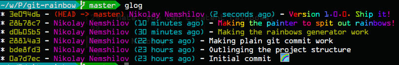

# Git::Rainbow

According to our own research, every year there are millions
of programmers suffer from the lack of rainbows in their git commits.
It is a serious issue, which escalates with age due to the ever
reducing number of dopamine receptors in the brain.

Lets leave those inhumane working conditions in the past! Introducing
`git rainbow`!

```
gem install git-rainbow
```

Once you have that, go into your project and type:

```
git-rainbow -m 'Adding more rainbows to the project!'
```

It works just like a normal `git commit`, but produces the a rainbowy
commit text. If you've done everything right it should look kind of like
this:



## Copyright & License

Mate, you can't patent rainbows!

-- Nikolay
